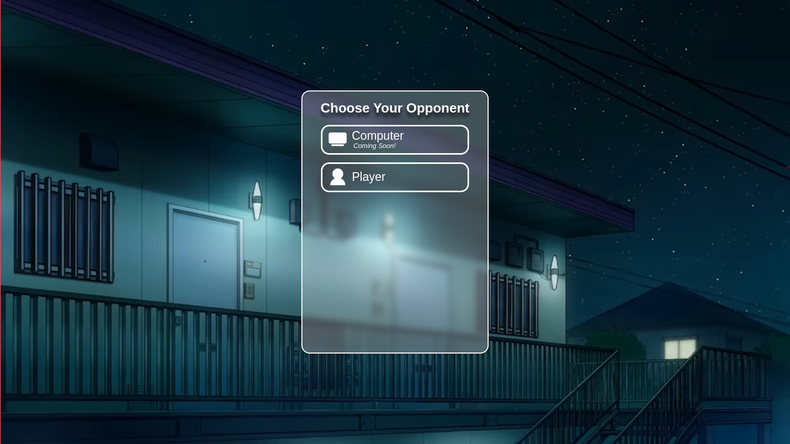
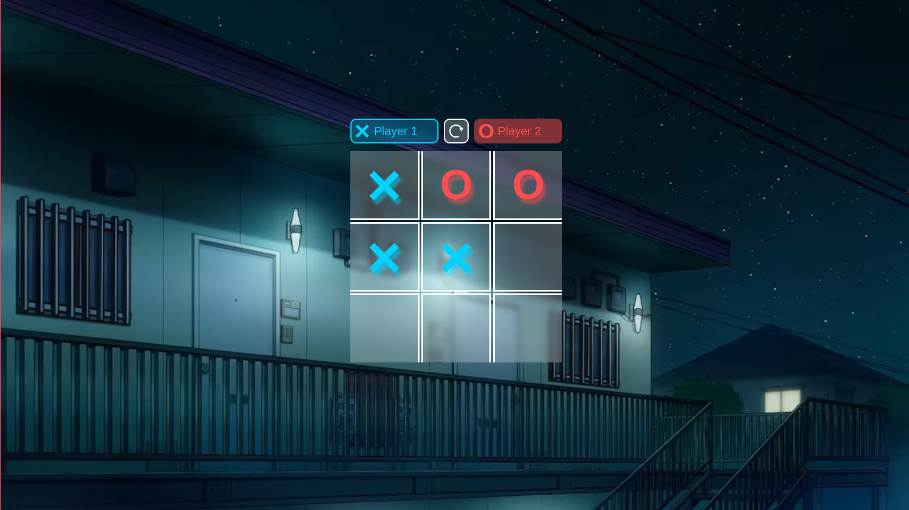
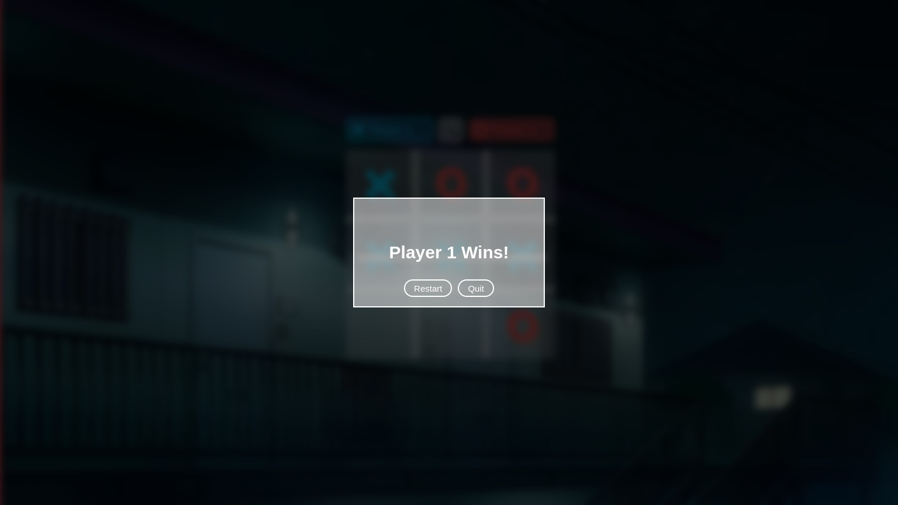

# A simple Tic Tac Toe game in Modern Design
This is just a simple tic tac toe game with glassmorpishm design.
> If you don't know what Glassmorpishm is. Glassmorphism is a UI design trend that imitates the look of frosted glass. It is a style that uses properties of glass to enhance designs, giving a translucent or transparent look and feel to its elements. This design is widely used in some software and operating system UI.

## Why I make it?
First, it is just for fun. Second, I got bored with the casual tic tac toe game design. It looks like a scribble on paper. So, I want to make something different with it. Third, I also like glassmorphism design lately. It looks beautiful, isn't it? And also, many of desktop operating system has adopted this design (like Windows, Mac OS, and Linux (not really, but it looks good when using it. Especially with KDE Plasma :D))

## How do I run it?

Desktop/Laptop (Windows, Mac OS, Linux)

Well... Since it's actually a web based game, to run it is very easy. All you have to do is clone this repository and run **index.html** file through your favorite web browser (like Chrome, Edge, Safari, Firefox, etc). It should run perfectly on any browser (except IE. Anyway... Who is still use IE these day?)

Mobile (Android)

Due to Android limitations, you can't just run local HTML file through your web browser just like in the desktop. You need some workaround to solve it. There are many workaround that you can try. But I recommend to use a local web server to run it. You can use [Simple HTTP Server](https://play.google.com/store/apps/details?id=com.phlox.simpleserver) app to create a local web server on your Android phone. 

## License
See [LICENSE.md](LICENSE.md)

## Contribute
Feel free to do pull requests. But you can also just open an issue if you found any bug in this program or you just want to give a feedback.

## Future Updates
- Adding computer opponent
- Illusion when hovering the box
- Dark mode

## Preview

